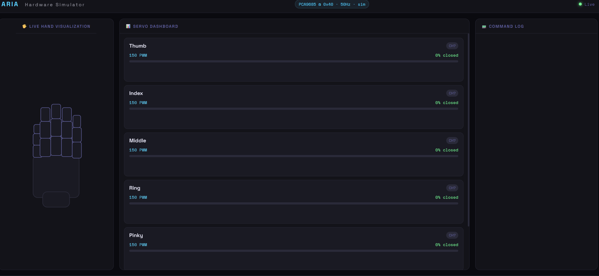

# ARIA: Autonomous Robotic Intelligence Arm

ARIA is a Raspberry Pi 5-powered robotic hand system that uses **local Machine Learning** (Gemma 4 via Ollama and OpenAI Whisper) or **cloud LLMs** (via OpenRouter) to understand and execute natural language voice commands.

## 🏗 Pipeline Architecture

```text
  📷 [ USB Camera ]       🎤 [ USB Mic ]
         │                      │
         ▼                      ▼
  [ Frame Capture ]      [ Whisper tiny ]
         │                      │
         └──────────┬───────────┘
                    ▼
          [ Gemma 4 / Gemini ]  ◄── multimodal: text + image
           (Ollama or OpenRouter)
                    │
                    ▼  (Tool Calls)
           [ ARIA Executor ]
                    │
                    ▼
          [ PCA9685 Driver ] ─── I2C ───► [ 6x MG996R Servos ]
                    │
                    ▼
            [ Robotic Hand ]
```

---

## ⚙️ Backend Configuration

ARIA supports two LLM backends. Switch between them with an environment variable or CLI flag.

### Option A: Ollama (Local, Free)
Runs entirely on your machine. No API key needed. Best for Pi deployment.
```bash
# Set backend (default is ollama)
export ARIA_BACKEND=ollama
ollama pull gemma4:e4b
python main.py
```

### Option B: OpenRouter (Cloud, Fast)
Uses OpenRouter's API. Great for development or if the Pi 5 is under heavy load.
```bash
# Create a .env file from .env.example
export ARIA_BACKEND=openrouter
export OPENROUTER_API_KEY=your_key_here
python main.py
```

Get an API key at: [https://openrouter.ai/keys](https://openrouter.ai/keys)

| Model | Speed | Cost | Best For |
|---|---|---|---|
| google/gemma-2-27b-it | Fast | ~$0.001/cmd | High Quality |
| google/gemini-flash-2.0 | Very fast | ~$0.0002/cmd | Low Latency |
| anthropic/claude-3-haiku | Fast | ~$0.0004/cmd | Complex Reasoning |

---

## 🔌 Hardware Setup

### Wiring Table (Pi to PCA9685)
| Raspberry Pi 5 Pin | PCA9685 Pin | Description |
| :--- | :--- | :--- |
| 5V (Pin 2 or 4) | VCC / V+ | Power for Controller & Servos |
| GND (Pin 6) | GND | Ground |
| GPIO 2 (SDA) | SDA | I2C Data |
| GPIO 3 (SCL) | SCL | I2C Clock |

### Servo Channel Mapping
| PCA9685 Channel | Component |
| :--- | :--- |
| Channel 0 | Thumb |
| Channel 1 | Index finger |
| Channel 2 | Middle finger |
| Channel 3 | Ring finger |
| Channel 4 | Pinky finger |
| Channel 5 | Wrist Rotation |

---

## 🚀 Installation

### 1. Prerequisite: Local LLM
ARIA requires [Ollama](https://ollama.com/) for local mode.
```bash
ollama pull gemma4:e4b
```

### 2. System Dependencies
```bash
sudo apt update
sudo apt install portaudio19-dev libffi-dev libssl-dev ffmpeg \
                 libopencv-dev python3-opencv
```

### 3. Python Setup
```bash
git clone https://github.com/yourusername/aria.git
cd aria
pip install -r requirements.txt
cp .env.example .env # Then edit .env with your keys
```

---

## 🎮 Usage

```bash
# Start with default settings
python main.py

# Switch backend via CLI
python main.py --backend openrouter

# Vision mode (requires camera)
python main.py --vision --text
```

### Example Commands
- *"ARIA, give me a peace sign."*
- *"Grab the red object in front of you."* (Requires --vision)
- *"Wave hello to the crowd!"*

---
## Simulator
```bash 
python main.py --sim
```

## 🛡 License
MIT License.
